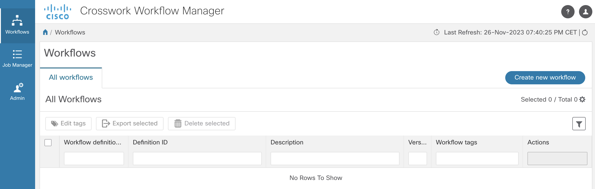

# cwm-json-schema-validator
A CWM adapter written in Go for validating the JSON input data for a workflow against its JSON Schema.  It allows CWM workflows to perform data input validation prior to executing the workflow.

## Table of contents

- [Introduction](#introduction)
- [Prerequisites](#prerequisites)
- [CWM SDK Tutorial](#cwm-sdk-tutorial)
- [Implementation of the Validate RPC call in the CWM adapter](#implementation-of-the-validate-rpc-call-in-the-cwm-adapter)
- [Building the CWM adapter](#building-the-cwm-adapter)
- [Testing the CWM adapter](#testing-the-cwm-adapter)
- [Used in practice](#used-in-practice)

## Introduction

Crosswork Workflow Manager (CWM) enables customers to build their own automation workflows, with capabilities to integrate to existing Operations Support Systems (OSS) and Business Support Systems (BSS) within their environment. These integrations are achieved through the use of adapters.

In addition to developing adapters using the CWM SDK for integraing with external software systems through their APIs, utility functions can also be developed using adapters to allow them to be invoked to perform data manipulations that can't be handled with jq Expressions while executing the workflows.

One such utility function is to validate the JSON input data needed to execute a CWM workflow against its schema.  This prevents any unnecessary workflow code to be run if the workflow is being fed with invalid input data.

## Prerequisites
- [**CWM** 1.1 installed using OVA](https://www.cisco.com/c/en/us/td/docs/net_mgmt/cisco_workflow/AdministratorGuide1-1/b_administrator-guide1/m_install-cwm-using-ova_1-1.html)
  - [CWM SDK](https://www.cisco.com/c/en/us/td/docs/net_mgmt/cisco_workflow/AdapterDevGuide1-1/b_adapter-developer-guide_1-1/m_use-adapter-sdk_1-1.html)

## CWM SDK Tutorial

You can find a presentation on [how to build a utlity function adapter for CWM](https://www.youtube.com/watch?v=_nvpyjtNbo8) during the Automation Developer Days in Stockholm on May 21st, 2024.  The presentation walked you with the steps for developing a utility function adapter using the CWM SDK from scratch.

Working with a utility function adapter is typically much simpler than an adapter for interfacing with an external system as you don't usually have to deal with resources and secrets.

## Implementation of the Validate RPC call in the CWM adapter

Source code for activities.go can be found [here](./adapter/cisco-jsonschema/go/validate/activities.go).  The open source Go library called [gojsonchema](https://github.com/xeipuuv/gojsonschema) was used to implement the Validate RPC call in the JSON Schema Validation adapter for CWM.

Since both the JSON input and the JSON schema in the Request message of the adapter are defined as JSON objects, the most appropriate loader from gojsonschema to use is the NewGoLoader as shown in the following 2 lines of Go code:

```
schemaLoader := gojsonschema.NewGoLoader(req.GetJsonSchema())
documentLoader := gojsonschema.NewGoLoader(req.GetJsonInput())
```
To perform the validation, you will make the following call in the gojsonschema library:

```
result, err := gojsonschema.Validate(schemaLoader, documentLoader)
```

Based on the return value of result, you can determine whether the validation is successful or not.  When it has failed validation, the errors are also contained in result.

## Building the CWM adapter

```
% git clone https://github.com/waitai/cwm-json-schema-validator/
Cloning into 'cwm-json-schema-validator'...
remote: Enumerating objects: 30, done.
remote: Counting objects: 100% (30/30), done.
remote: Compressing objects: 100% (23/23), done.
remote: Total 30 (delta 2), reused 27 (delta 2), pack-reused 0
Receiving objects: 100% (30/30), 75.54 KiB | 2.04 MiB/s, done.
Resolving deltas: 100% (2/2), done.
% cd cwm-json-schema-validator/adapter/cisco-jsonschema
% tree
.
├── Makefile
├── adapter.properties
├── docs
│   └── index.html
├── go
│   ├── common
│   │   ├── cisco.jsonschema.common.adapter.pb.go
│   │   ├── errors.go
│   │   └── logger.go
│   ├── go.mod
│   ├── go.sum
│   └── validate
│       ├── activities.go
│       ├── adapter.go
│       └── cisco.jsonschema.validate.adapter.pb.go
└── proto
    ├── cisco.jsonschema.common.adapter.proto
    └── cisco.jsonschema.validate.adapter.proto

6 directories, 13 files
% cwm-sdk create-installable
% tree out
out
└── cwm.v1.1.cisco.jsonschema.v1.0.0.tar.gz

1 directory, 1 file
```

## Testing the CWM adapter

### CWM Configuration

#### Adapter and Worker

Open CWM in browser, in *Admin* tab, go to *Adapters*, upload the adapter file that was just created in the previous step by clicking *Add Adapter* and selecting it from its installed folder under out.
Check the *Create Worker* box to automatically create a worker for the installed adapter.


### Workflow Definition
Workflows are defined using a standardized *Domain Specific Language* based on the [Serverless Workflow specification](https://github.com/serverlessworkflow/specification/blob/main/README.md), enabling workflow designers to express complex business processes, dependencies, and decision logic in a unified and readable format.

### JSON Schema Validation Workflow

The [JSON Schema Validation workflow](./workflow/JSON-Schema-Validation.sw.json) starts with an inject state with a static JSON schema to be used for validating the JSON input data being passed to the workflow.  It then transitions to validating that the provided JSON input is an array.  Next, it makes a function call into the JSON Schema Validation adapter to validate the passed in JSON input data against the static JSON schema embedded in the workflow.

### Run the Workfow

Install the JSON Schema Validation workflow by navigating to the Workflows tab in CWM UI:



Click *Create new workflow*.


Click on the "Create Workflow" button.  Once the JSON-Schema-Validation workflow has been created, click on the newly created workflow.


Go to *Code* tab and paste the [JSON Schema Validation workflow](./workflow/JSON-Schema-Validation.sw.json) there and save changes.


Click on the Run button, and provide the input JSON data from [here](./workflow/json-input-test-data.json).


Once the wokflow execution job is started by clicking on "Run job", you can go to the Job tab to see the results. 

#### Positive Result

 The results can be seen from the workflow execution completed event as shown below.

 

#### Negative Result

By modifying the 1st operation-type field in the input JSON data from "Auto" to "Test" and re-run the job, 


you will will see the following result showing the validation error.

 

 ## Used in practice

 Your newly written workflows can now make use of this JSON Schema Validation adapter to determine whether to proceed with executing the rest of the workflow code or to abort upon the detection of input data validation errors.  This adapter can be useful until CWM comes with its own built-in JSON schema validator.